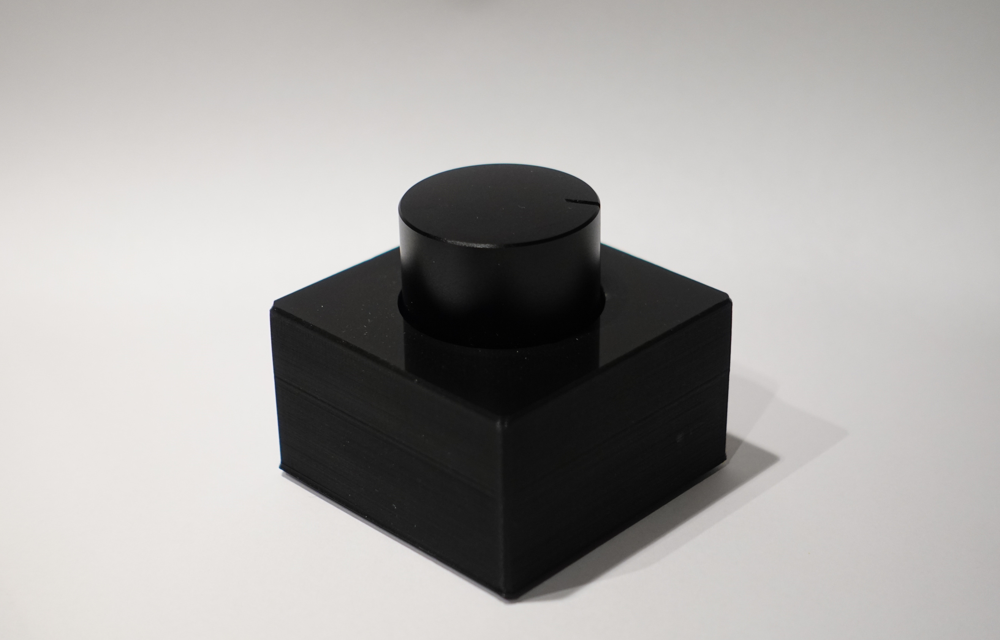

# Arduino Volume Dial

Arduino-based dial acting as a USB HID device for volume control.

An Arduino compatible board with an Atmega32u4 that has Human Interface Device capability is required.
Code for either a digital rotary encoder (using this [Encoder Library](https://github.com/PaulStoffregen/Encoder)) or an analog potentiometer is provided.

The case is designed for a metal volume dial from an old radio and can be easily adapted.
